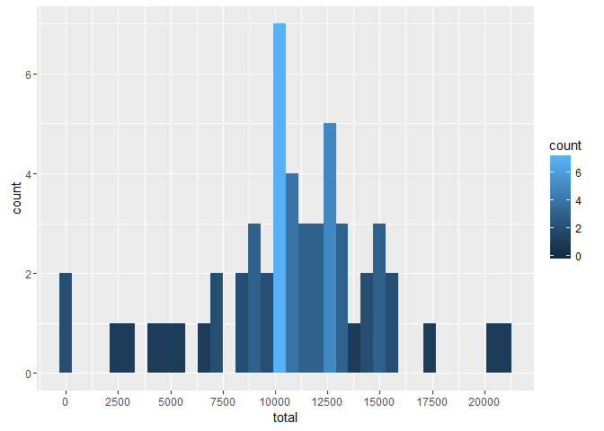
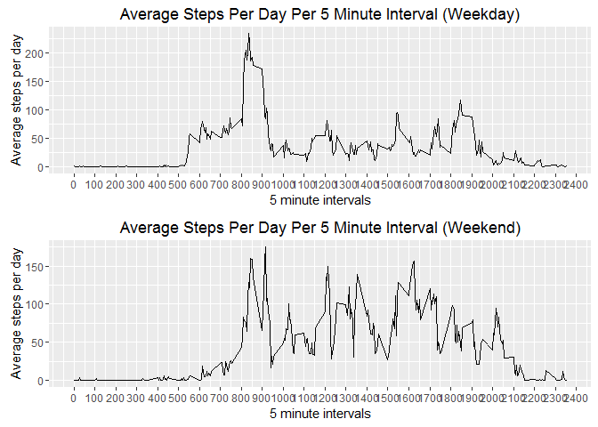

# Reproducible Research: Peer Assessment 1


echo=FALSE


The following libraries will need to be loaded to execute the following code.

```r
suppressWarnings(library(dplyr))
```

```
## 
## Attaching package: 'dplyr'
```

```
## The following objects are masked from 'package:stats':
## 
##     filter, lag
```

```
## The following objects are masked from 'package:base':
## 
##     intersect, setdiff, setequal, union
```

```r
suppressWarnings(library(ggplot2))
suppressWarnings(library(timeDate))
suppressWarnings(library(gridExtra))
```

```
## 
## Attaching package: 'gridExtra'
```

```
## The following object is masked from 'package:dplyr':
## 
##     combine
```

## Loading and preprocessing the data

The following code unzips the "activity.zip" file and reads the contents into a variable "actdat" with read.csv.

```r
actdat <- read.csv(unz("activity.zip", "activity.csv"))
```


## What is mean total number of steps taken per day?

This code calculates the total number of steps per day and assigns it to the totstepd variable.

```r
totstepsd <- actdat %>% na.omit() %>% group_by(date) %>% summarise(total = sum(steps))
```

The following code creates a histogram of the total number of steps taken each day using the ggplot2 package.


```r
ggplot(totstepsd, aes(x = total)) + geom_histogram(binwidth = 600, aes(fill = ..count..)) + scale_x_continuous(breaks = seq(0,25000, by = 2500))
```



The following code ouputs the histogram to a png file called "hist1.png"

```r
ggsave(filename = "hist1.png")
```

```
## Saving 7 x 5 in image
```
The following code calculates the mean and median number of steps taken per day and prints the results for both.

```r
meansteps_day <- mean(totstepsd$total)
medsteps_day <- median(totstepsd$total)
print(meansteps_day)
```

```
## [1] 10766.19
```

```r
print(medsteps_day)
```

```
## [1] 10765
```
The results of the output are as follows:
*Median steps per day = 10765
*Mean steps per day = 10766.19

## What is the average daily activity pattern?

Group actdat by interval and summarise the average number of steps per interval across all days.


```r
avg5int <- actdat %>% na.omit() %>% group_by(interval) %>% summarise(avg = mean(steps))
```

Plot the time series graph with ggplot2 and save it as "time.png"

```r
ggplot(data = avg5int, mapping = aes(x = interval, y = avg)) + geom_line() + scale_x_continuous(breaks = seq(0, 2400, by = 100)) + xlab("5 minute intervals") + ylab("Average steps per day") + ggtitle("Average Steps Per Day Per 5 Minute Interval")
```


```r
ggsave(filename = "time1.png")
```

```
## Saving 7 x 5 in image
```

This code determines which 5 minute interval contains the maximum number of steps and prints the results.


```r
maxsteps <- avg5int %>% filter(avg == max(avg))
print(maxsteps)
```

```
## Source: local data frame [1 x 2]
## 
##   interval      avg
##      (int)    (dbl)
## 1      835 206.1698
```

RESULTS: The maximum numbers of steps were 206 and it occurred in the 835 interval.

The following code calculates and prints the number of NA fields.


```r
countna <- actdat %>% group_by(steps) %>% summarise(num = n()) %>% filter(is.na(steps))
print(countna)
```

```
## Source: local data frame [1 x 2]
## 
##   steps   num
##   (int) (int)
## 1    NA  2304
```
RESULTS:  There were 2304 NA fields.

The following code imputes the NA fields with the mean of steps for each grouped interval.

```r
impactdat <- actdat %>% group_by(interval) %>% mutate(steps = ifelse(is.na(steps), mean(steps, na.rm = TRUE), steps))
```

The following code calculates the number of steps per day and saves it to variable totstepsd_imp.

```r
totstepsd_imp <- impactdat %>% na.omit() %>% group_by(date) %>% summarise(total = sum(steps))
totstepsd_na <- actdat %>% group_by(date) %>% summarise(total = sum(steps))
```

The following code prints the two graphs using ggplot2 and multiplot.


```r
impplot2 <- ggplot(totstepsd_na, aes(x = total)) + geom_histogram(binwidth = 600, aes(fill = ..count..)) + scale_x_continuous(breaks = seq(0,25000, by = 2500)) + ylim(0,15) + ggtitle("Total number of steps per day without data imputation")

impplot1 <- ggplot(totstepsd_imp, aes(x = total)) + geom_histogram(binwidth = 600, aes(fill = ..count..)) + scale_x_continuous(breaks = seq(0,25000, by = 2500)) + ylim(0,15) + ggtitle("Total number of steps per day with data imputation")

grid.arrange(impplot1, impplot2)
```

```
## Warning: Removed 8 rows containing non-finite values (stat_bin).
```


```r
png(filename = "hist2.png")

grid.arrange(impplot1,impplot2)
```

```
## Warning: Removed 8 rows containing non-finite values (stat_bin).
```

```r
dev.off()
```

```
## png 
##   2
```

```r
##Detaching this module as it seems to mess up dplyr on my machine.
```

## Are there differences in activity patterns between weekdays and weekends?

This code creates a new column in actdat called Weekday that describes the day of the week.

```r
actdat1 <- actdat
actdat1$weekday <- weekdays(as.Date(actdat$date))
```

This code determines if a date is weekday or weekend and save it to the new wkday column.

```r
actdat1$wkday <- isWeekday(actdat1$date)
```

This code renames the variables in wkday: True to "weekday" and False to "weekend"


```r
actdat1 <- actdat1 %>% mutate(wkdayend = replace(wkday, wkday == FALSE, "weekend"))
actdat1 <- actdat1 %>% mutate(wkdayend = replace(wkdayend, wkdayend == TRUE, "weekday"))

avg5intwkday <- actdat1 %>% select(c(steps, interval, wkdayend)) %>% group_by(interval)
```

This code determines the averages for the weekdays and the weekend days and saves them to new variables.

```r
wkdayavg_steps <- avg5intwkday %>% ungroup() %>% na.omit() %>% filter(wkdayend == "weekday") %>% select(c(steps, interval, wkdayend)) %>% group_by(interval) %>% summarize(avg = mean(steps))

wkendavg_steps <- avg5intwkday %>% ungroup() %>% na.omit() %>% filter(wkdayend == "weekend") %>% select(c(steps, interval, wkdayend)) %>% group_by(interval) %>% summarize(avg = mean(steps))
```

This code creates the two plots using ggplot2 and prints it to timeplot3.png and to the screen.


```r
weekdayplot <- ggplot(wkdayavg_steps,aes(interval, avg)) + geom_line() + scale_x_continuous(breaks = seq(0, 2400, by = 100)) + xlab("5 minute intervals") + ylab("Average steps per day") + ggtitle("Average Steps Per Day Per 5 Minute Interval (Weekday)")

weekendplot <- ggplot(wkendavg_steps,aes(interval, avg)) + geom_line() + scale_x_continuous(breaks = seq(0, 2400, by = 100)) + xlab("5 minute intervals") + ylab("Average steps per day") + ggtitle("Average Steps Per Day Per 5 Minute Interval (Weekend)")

grid.arrange(weekdayplot,weekendplot)
```



```r
png(filename = "timeplot3.png")
grid.arrange(weekdayplot,weekendplot)
dev.off()
```

```
## png 
##   2
```
